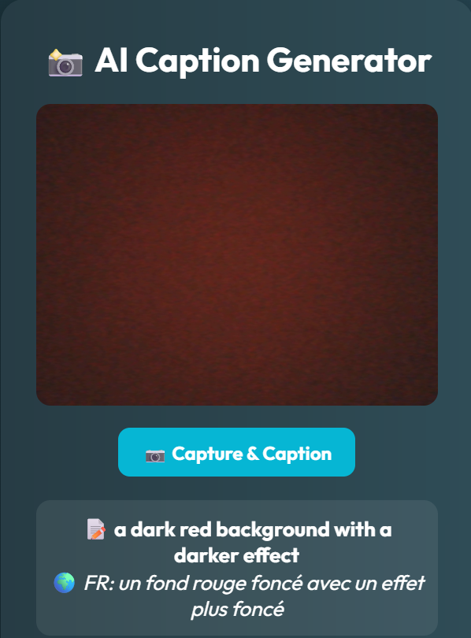

# 📸 AI Caption Generator

An elegant and user-friendly web application that captures webcam images and generates intelligent captions using the BLIP-2 vision-language model. Captions are also translated to French using a language model, making the tool accessible to a broader audience.



## ✨ Features

* 🔍 Real-time webcam capture
* 🧠 AI-powered caption generation with [Salesforce/BLIP-2](https://huggingface.co/Salesforce/blip2-opt-2.7b)
* 🌍 Automatic translation of captions to French
* 💅 Stylish, modern UI with dark mode and animation
* 🚀 FastAPI backend with a responsive HTML/JS frontend

---

## 🗂️ Project Structure

```
📆 ai-captioning-webcam/
🔹 app.py                 # FastAPI backend server
🔹 model_loader.py        # BLIP-2 model and caption logic
🔹 frontend/
└︎🔹 index.html         # Main frontend HTML with webcam UI
    🔹 screenshot.png     # UI screenshot
🔹 .gitignore             # Ignores vlm-env and other files
🔹 vlm-env/ (excluded)    # Your Python virtual environment
```

---

## 💠 Setup Instructions

1. **Clone the repository**

```bash
git clone https://github.com/nadasaidi23/ai-captioning-webcam.git
cd ai-captioning-webcam
```

2. **Set up virtual environment**

```bash
python -m venv vlm-env
vlm-env\Scripts\activate  # On Windows
```

3. **Install dependencies**

```bash
pip install -r requirements.txt
```

4. **Run the FastAPI server**

```bash
uvicorn app:app --reload
```

5. **Open the frontend**

Open `frontend/index.html` in your browser. Ensure the backend server is running at `http://127.0.0.1:8000`.

---

## 🧠 Model Details

* Model: `Salesforce/blip2-opt-2.7b`
* Frameworks: PyTorch, Transformers, FastAPI
* Translation via `transformers` pipeline (`Helsinki-NLP/opus-mt-en-fr`)

---

## 📸 Demo


> Example:
>
> **Caption**: `a dark red background with a darker effect`
> **FR**: `un fond rouge foncé avec un effet plus foncé`

---

## 📄 License

MIT License — feel free to use, modify, and share.

---

## 🙌 Contributions

Pull requests welcome! Let’s make the captioning more accurate, add more languages, or enhance the UI together.
